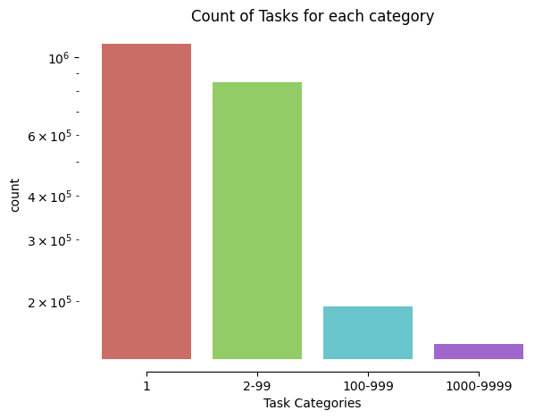
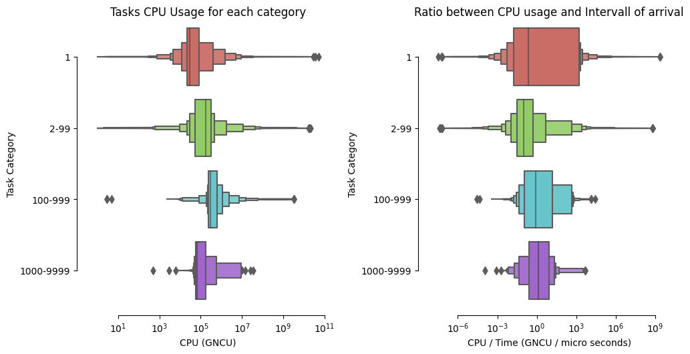
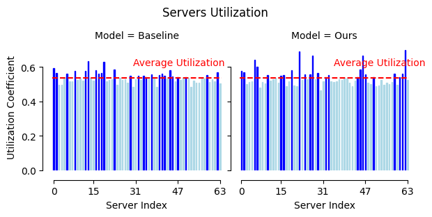
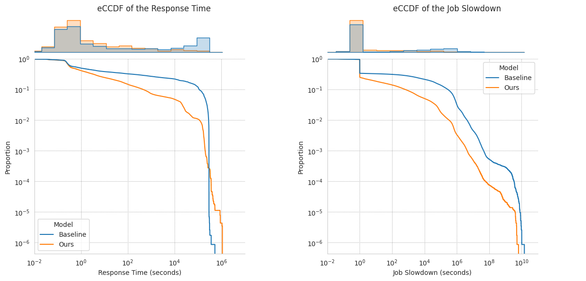

# Google Traffic Analysis

The project objective was to analyse a Google traffic trace and build an optimal pair of dispatcher and scheduler to minimize the jobs response time and comparing it against a baseline (LWL dispatcher and FCFS scheduler).

We divided the jobs in 4 categories:



**Note**: A job is a formed by one or more tasks.

And then we gave a look to the CPU utilization box plot of each category:



Our scheduler strategy was trying to prioritize jobs with with smaller number of tasks due to the fact of the imbalance of the traffic. To overcome the possible starvation we opted for a pre-emptive scheduling policy with an additional implementation of aging.

We wanted to preserve a LWL type of dispatcher, so we had to modify it to make it work properly with our scheduler: the dispatcher when sending a task to the server prioritize the servers with less number of working tasks left, then the ones with fewest work left. Ties are solved at random.


|Model|$\overline{R}$|$\overline{S}$|$\rho$|$\overline{L}$|
|:----|-------------:|-------------:|-----:|-------------:|
|**Baseline**|27603 seconds|1241601|0.5382|129 messages|
|**Ours**|7225 seconds|444314|0.5382|66 messages|

> Comparison among the two models in terms of Response Time $(\overline{R})$, Job Slowdown $(\overline{S})$, Mean Utilization Coefficient $(\rho)$
and mean message load $(\overline{L})$.

Our pair of dispatcher and scheduler menage to outclass the baseline by decreasing the $\overline{R}$ and $\overline{S}$ by 89.47%, while keeping an uniform server utilization:



From the eCCDF plots of $\overline{R}$ and of $\overline{S}$ we can notice that our pair seems to perform always better than the baseline (yes our pair gets higher peaks in terms of Response Time, but they are way less frequent than the baseline ones and their value can be reduced by implementing a more aggressive aging policy).



## Directory Structure

```
./root
  |_ src/
  |   |_ notebook.ipynb
  |_ img/
  |   |_ cpu_utilization.png
  |   |_ response_time_jobslowdown.png
  |   |_ packets_category.png
  |   |_ server_utilization.png
  |_ report.pdf
  |_ requirements.txt
```

## Dependencies

Some python modules: to install them just run in a terminal `pip install -r requirements.txt` from the root directory of the project.

It is strongly suggested to create and activate a python virtual environment in the project root folder, then remember to set the environment as kernel for `notebook.ipynb` ([here](https://janakiev.com/blog/jupyter-virtual-envs/) a guide).

## Team

- [Mario Edoardo Pandolfo](https://github.com/JRhin)
- [Gabriele Pelliccioni](https://github.com/gabrielepelliccioni13)
- [Giuseppe di Poce](https://github.com/giuseppedipoce)
